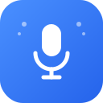
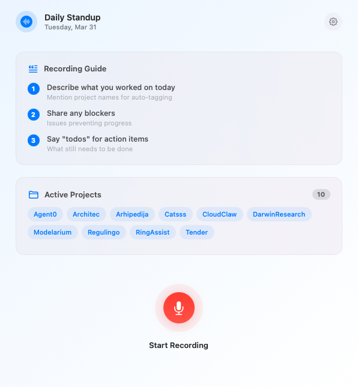
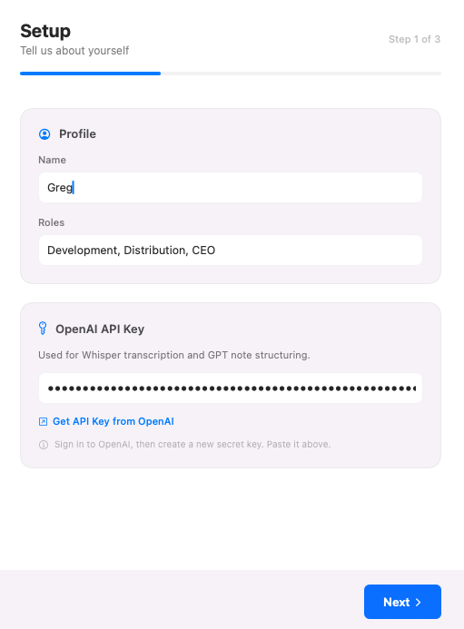
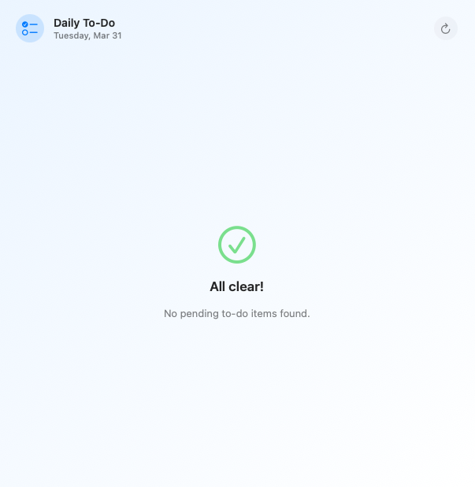

<p align="center">
  
</p>

<h1 align="center">Daily Standup</h1>

<p align="center">
  A macOS menu bar app that records your daily standup via voice, transcribes it with AI, and commits structured notes to a git repository.
  <br/>
  The repository serves as a living record of your work — designed to be used as context for other AI tools.
</p>

---

## How it works

1. **Record** -- click the mic button and describe what you worked on, any blockers, and what's next
2. **AI processes** -- transcribes audio (OpenAI Whisper), then structures your notes into clean bullet points tagged by project (GPT-4o-mini)
3. **Review & edit** -- tweak the output before committing
4. **Commit** -- writes per-project standup, todo, and git activity files, then commits to the repo
5. **Daily reminder** -- opens the standup window at your configured time

<p align="center">
  
</p>

## The repository as AI context

The standup repository is designed to be consumed by other AI tools. Each project folder contains structured markdown files that give any AI a clear picture of what you're working on:

```
standup-repo/
  projects/
    greg-standup.md          <-- general standup notes
    greg-todo.md             <-- general todos
    Regolingo/
      project.md             <-- AI-generated project description
      metadata.json          <-- repo paths, website
      greg-standup.md        <-- standup notes for this project
      greg-todo.md           <-- todos for this project
      greg-git.md            <-- AI-summarized git commits
    AnotherProject/
      ...
```

Point other AI tools (Claude, Cursor, etc.) at this repository to give them context about your projects, recent work, and priorities.

## Setup

On first launch a setup wizard walks you through three steps:

<p align="center">
  
</p>

**Step 1: Profile & API Key** -- Enter your name, roles, and OpenAI API key. A button links directly to the OpenAI dashboard to create a key.

**Step 2: Repository & Projects** -- Choose a folder for your standup repository. The app creates a git repo with the right structure, or detects an existing one. Add your projects with:

- **Name** -- becomes a folder in the repo
- **Description** -- short summary
- **Repositories** -- one or more local git repo paths (the app fetches your daily commits and writes an AI summary to `git.md`)
- **Website** -- fetched and summarized by AI into `project.md`
- **Fetch git activity** -- toggle per project

**Step 3: Preferences** -- Set your daily reminder time, choose a microphone, and configure launch at login.

## Daily To-Do

Click **Show Daily To-Do** from the menu bar. Shows all pending tasks across projects, organized and prioritized by AI. Cached so it opens instantly; refreshes once per day.

<p align="center">
  
</p>

## Building from source

Requires Xcode 15+ and [xcodegen](https://github.com/yonaskolb/XcodeGen).

```bash
brew install xcodegen
xcodegen generate
xcodebuild -scheme DailyStandup -configuration Debug build
```

Or open `DailyStandup.xcodeproj` in Xcode and build from there.
